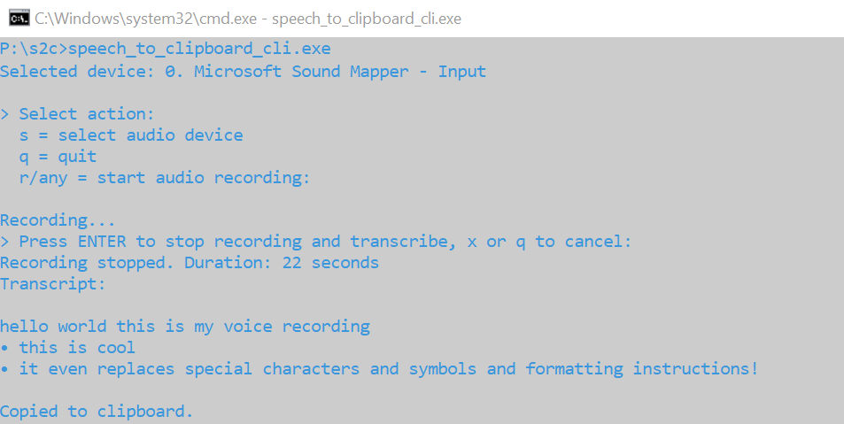
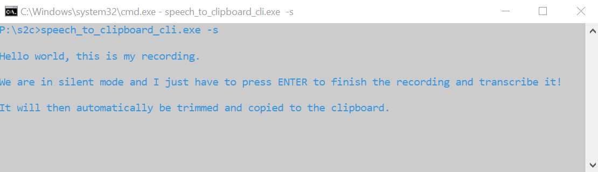
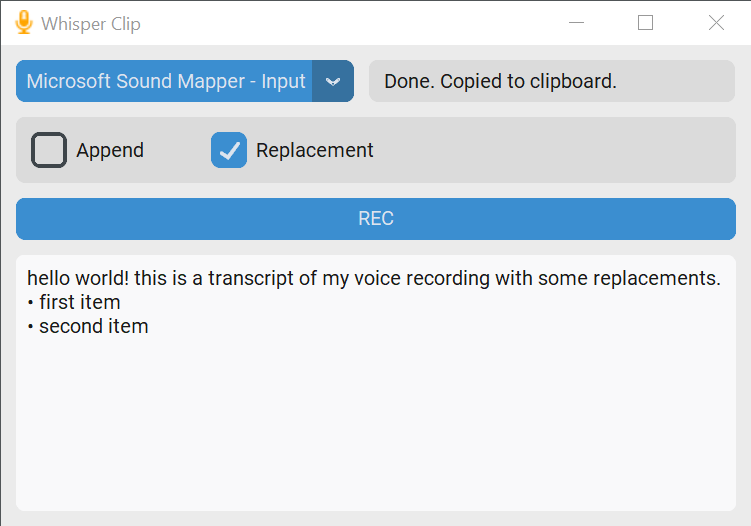

<h1 align="center">Speech To Clipboard</h1>

    
    
    
    

A tool for **recording audio from a microphone and automatically transcribing the recording** using OpenAI's *Whisper* model via OpenAI's API. The **transcription is copied to the clipboard** for easy pasting into other applications. 

It comes with a **command line interface** with different modes (interactive, verbose, silent, one-shot) as well as with a **UI**.

The tool also **supports simple configurable text replacements**, similar to the voice recording feature on iOS. For example, it can replace the text "new line" with an actual new line or "bullet point" with "`• `".

Written in Python. 
Developed by [Claus Helfenschneider Interactive Applications](https://interactive-applications.com).

| CLI | UI |
|--|--|
| Verbose Mode:  Silent Mode:  |  |

## Installation

1. Clone the repository.
1. (Optional but recommended) Set up a virtual environment. Requires **Python 3.11** or higher.
1. Install the requirements:
    - `pip install -r requirements.in` for the latest versions (recommended), or
    - `pip install -r requirements.txt` for pinned versions.
1. To build an `.exe`, install the dev requirements:
    - `pip install -r requirements-dev.in`
1. Set the environment variable `WHISPER_KEYBOARD_API_KEY` to your OpenAI API Key. You can either set it in your global environment, add it to an `.env` file or specify it in the [config.ini](resources/config.ini) file under `[openai] api_key`.
    - **Note:** An environment variable takes precedence over the value set in the config file.

## Usage (CLI)

1. Run the command line interface: `python speech_to_clipboard_cli.py`
1. For available options, run `python speech_to_clipboard_cli.py --help`.

## Usage (GUI)
1. Run the UI: `python speech_to_clipboard_ui.pyw`
1. Select your preferred microphone from the dropdown menu.
1. Press **REC** to start recording.
1. Press **Stop Recording** to end the recording. The audio will be sent to the OpenAI API for transcription, and the result will be copied to your clipboard.

## Create Executable With AutoPyToExe

To build an executable file (`.exe` on *Windows*) using [AutoPyToExe](https://github.com/brentvollebregt/auto-py-to-exe), follow these steps:

1. Install the dev requirements: `pip install -r requirements-dev.in`
1. Depending on whether you want to build the UI or the CLI app, choose the corresponding configuration file:
    - UI: [auto-py-to-exe-config_ui.json](auto-py-to-exe-config_ui.json)
    - CLI: [auto-py-to-exe-config_cli.json](auto-py-to-exe-config_cli.json)
1. There are some absolute paths in the configuration file, which have to be replaced by the path to your local project. Alternatively you can just take the config file as a reference to adjust the settings in the UI.
1. Execute `auto-py-to-exe -c <YOUR_CONFIG_FILE>` with the adjusted config file.
1. Load the configuration file: **Settings** → **Configuration** → **Import Config From JSON File**
1. Click **Convert .py to .exe**

## Text Replacer

The tool features a simple text replacement system. When enabled via the **Replacer** checkbox, it can replace certain expressions as follows:

| Expression    | Replacement |
|---------------|-------------|
| `new line`    | `\n`        |
| `bullet point`| `• `        |
| `en dash`     | `–`         |
| ...           | ...         |

Configure or edit the replacements in the [resources/replacements.json](resources/replacements.json) file.

## Contributions & Feedback

Contributions and feedback are welcome! Please open an issue or submit a pull request.

## Credits

By Claus Helfenschneider Interactive Applications @ [www.interactive-applications.com](https://interactive-applications.com)

If you enjoy this project, please consider [buying me a coffee](https://www.buymeacoffee.com/interactiveapplications), check out my [website](https://interactive-applications.com), and reach out to me. I'd love to hear from you! 

**I am open for hire/commissions.**

## License

This project is licensed under the MIT License. See the [LICENSE](LICENSE) file for details.

## Third-Party Licenses

This project uses the following third-party packages. Please refer to the respective license files for more details.

| Package | License | License File |
| ------- | ------- | ------------ |
| [CustomTKinter](https://github.com/TomSchimansky/CustomTkinter) | MIT | [Link](https://github.com/TomSchimansky/CustomTkinter/blob/master/LICENSE) |
| [OpenAI](https://github.com/openai/openai-python) | MIT | [Link](https://github.com/openai/openai-python/blob/main/LICENSE) |
| [python-sounddevice](https://github.com/spatialaudio/python-sounddevice) | MIT | [Link](https://github.com/spatialaudio/python-sounddevice/blob/master/LICENSE) |
| [python-soundfile](https://github.com/bastibe/python-soundfile) | BSD-3-Clause | [Link](https://github.com/bastibe/python-soundfile/blob/master/LICENSE) |
| [numpy](https://github.com/numpy/numpy) | BSD-3-Clause | [Link](https://github.com/numpy/numpy/blob/main/LICENSE.txt) |
| [pyperclip](https://github.com/asweigart/pyperclip) | BSD-3-Clause | [Link](https://github.com/asweigart/pyperclip/blob/master/LICENSE.txt) |
| [pydub](https://github.com/jiaaro/pydub) | MIT | [Link](https://github.com/jiaaro/pydub/blob/master/LICENSE) |
| [humanize](https://github.com/python-humanize/humanize) | MIT | [Link](https://github.com/python-humanize/humanize/blob/main/LICENCE) |
| [auto-py-to-exe](https://github.com/brentvollebregt/auto-py-to-exe) | MIT | [Link](https://github.com/brentvollebregt/auto-py-to-exe/blob/master/LICENSE) |

Development dependencies:

| Package | License | License File |
| ------- | ------- | ------------ |
| [pylint](https://github.com/pylint-dev/pylint) | GPL-2.0-or-later | [Link](https://github.com/pylint-dev/pylint/blob/main/LICENSE)
| [yapf](https://github.com/google/yapf) | Apache-2.0 | [Link](https://github.com/google/yapf/blob/main/LICENSE) |
